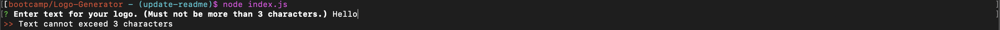
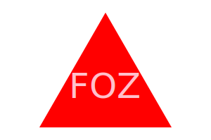

# Logo-Generator
  

  ## Description
  
  A simple command line program that will ask users a series of questions then generate an .svg file displaying a fitting logo based on their responses. 
  
  ## Table of Contents
    
  * [Installation](#installation)

  * [Usage](#usage)

  * [License](#license)

  * [Test](#tests)

  * [Credits](#credits)

  * [Questions](#questions)
  
  ## Installation

  To install necessary dependencies, run the following command:
  
  ```
  npm i
  ```
  
  ## Usage
  
  To initiate the application just run 'node index.js' in the terminal and you will be presented with 4 prompts. First you will be asked to input the text you would like for your logo (Note: text cannot exceed 3 characters and it must be at least 1 character). If you input an invalid text the terminal will display an appropriate message:

  

  A similar validation is applied for the color input that follows, you can enter any hexidecimal color value, any RGB color value, any hsl color value, or simply any color name in english (names must be one word). If the color input is not valid the terminal will alert the user and allow them to re-enter a valid color. 

  Next users will be prompted to select their desired shape for their logo. Using the arrow keys, users can select either Triangle, Square or Circle. Lastly the application prompts the user to input the shape/background color for their logo. Similar to the text color the terminal will only accept a valid color input. 

  Users can generate a wide variety of logos with these simple choices, below are a couple example svg files. 

  

  ## License

  This project is licensed under the MIT license.

  ## Tests

  To run tests, run the following command:
  
  ```
  npm test
  ```

  ## Credits

  ### Dependencies
  [inquirer](https://www.npmjs.com/package/inquirer) - The application utilizes the 'inquirer' package to retrieve information from the user through the terminal.

  [is-color](https://www.npmjs.com/package/is-color) - The application utilizes the 'is-color' package to efficiently check if the color input is a valid color. Through utilizing the is-color package in combination with inquierer's built in 'validate' functionality, all user inputs are immediately checked and deemed valid or prompts the user to enter a valid value.

  ### DevDependencies
  [jest](https://www.npmjs.com/package/jest) - The application used the jest package for automated testing throughout developement.

  ## Questions

  If you have any questions about the repo, open an issue or contact me directly at ddsmm.managlia@gmail.com. You can find more of my work at [dmanaglia](https://www.github.com/dmanaglia).
  
